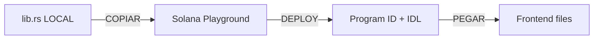

# 🚀 RESUMEN RÁPIDO: Deploy y Conexión

## ❓ TU PREGUNTA

> "¿Dónde pego el archivo lib.rs del despliegue en este proyecto para enlazar el frontend y la terminal en Solana Playground?"

---

## ✅ RESPUESTA DIRECTA

**NO pegas el `lib.rs` en tu proyecto local.**

El flujo correcto es:



---

## 📋 PASO A PASO (15 min total)

### **1. Copiar `lib.rs` A Solana Playground** (3 min)

**Archivo local:**

```
📁 prediction-market-contract/programs/prediction_market/src/lib.rs
```

**Dónde pegarlo:**

1. Abre https://beta.solpg.io/
2. Create New Project → Anchor
3. Abre el archivo `src/lib.rs` en Playground
4. **Borra todo** el contenido default
5. **Copia y pega** el contenido completo de tu `lib.rs` local (392 líneas)
6. Guarda (Ctrl+S)

---

### **2. Deploy en Playground** (5 min)

1. Click en **Build** (🔨)
2. Espera 1-2 min
3. Click en **Deploy** (🚀)
4. Confirma "Devnet"
5. **COPIA** el Program ID que aparece:

   ```
   Program ID: 7PZf8wZqG5t3H9xKvN4M8rY2wXq1Q3nC6sD9xJ2vL4kA
   ```

6. **COPIA** el IDL (tab "IDL" arriba, todo el JSON)

---

### **3. Pegar en el Frontend** (5 min)

#### 3.1 Pegar Program ID

**Archivo:**

```
📁 prediction-market/src/lib/solana/programId.ts
```

**Línea 23:**

```typescript
export const PROGRAM_ID = new PublicKey(
  'PEGA_AQUI_TU_PROGRAM_ID' // ← El que te dio Playground
)
```

#### 3.2 Pegar IDL

**Archivo:**

```
📁 prediction-market/src/lib/solana/idl.ts
```

**Línea 10:**

```typescript
export const IDL = {
  // PEGA AQUI TODO EL JSON que copiaste del tab "IDL" de Playground
  // Reemplaza todo desde { hasta } as const
} as const
```

---

### **4. Probar** (2 min)

```bash
cd prediction-market
npm run dev
```

Abre: `http://localhost:3000/test-contract`

Conecta wallet → Click "Fetch Markets"

✅ Si ves "Markets Found: 0" → **¡TODO FUNCIONA!**

---

## 📂 ARCHIVOS QUE YA ESTÁN LISTOS

Ya creé estos archivos en tu proyecto:

```
prediction-market/src/
├── lib/solana/
│   ├── programId.ts    ← Solo actualiza el Program ID (línea 23)
│   ├── idl.ts          ← Solo actualiza el IDL (desde línea 10)
│   └── contract.ts     ← YA LISTO (no tocar)
└── hooks/
    └── useContract.ts  ← YA LISTO (no tocar)
```

**Solo necesitas actualizar 2 líneas:**

1. Program ID en `programId.ts`
2. IDL completo en `idl.ts`

---

## 🎯 USO EN TUS PÁGINAS

Después de actualizar esos 2 valores, usa en cualquier componente:

```tsx
'use client'
import { useContract } from '@/hooks/useContract'

export default function MyPage() {
  const { markets, createMarket, placeBet, loading } = useContract()

  // Ya tienes acceso a:
  // - markets (array de mercados)
  // - createMarket() para crear
  // - placeBet() para apostar
  // - etc.
}
```

---

## 📚 GUÍAS COMPLETAS

Si quieres el paso a paso detallado, lee en orden:

1. **`GUIA_SOLANA_PLAYGROUND_DEPLOY.md`** - Cómo deployar
2. **`CONECTAR_FRONTEND_GUIA.md`** - Cómo conectar el frontend
3. **`prediction-market-contract/SDK_INTEGRATION.md`** - Referencia técnica

---

## 🔥 LO MÁS IMPORTANTE

**El `lib.rs` NO se pega en el proyecto local.**

```
❌ NO HAGAS ESTO:
   "Pegar lib.rs en prediction-market/src/lib/"

✅ HAZ ESTO:
   1. Copia lib.rs → Solana Playground (navegador)
   2. Deploy en Playground
   3. Copia Program ID + IDL → 2 archivos del frontend
```

---

## 💪 SIGUIENTE PASO

1. Ve a https://beta.solpg.io/
2. Copia tu `lib.rs` ahí
3. Deploy
4. Actualiza `programId.ts` e `idl.ts`
5. ¡Listo!

---

**¿Necesitas más detalles?** → Lee `CONECTAR_FRONTEND_GUIA.md`

**¿Dudas?** → Pregúntame lo que sea

**¡Vamos con todo! 🚀**
