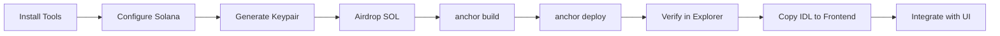

# ⚡ Quick Start - Deploy Smart Contracts en 15 minutos

## 🎯 Objetivo

Deployar tus smart contracts de Solana a Devnet en el menor tiempo posible.

---

## 📋 Opción 1: Instalación Automática (Recomendado)

### **Paso 1: Ejecutar Script de Instalación**

```powershell
# Abre PowerShell como Administrador
# Click derecho en PowerShell → "Ejecutar como administrador"

# Navega al directorio:
cd "C:\Users\edgar\cypherpunk hackathon2025\prediction-market-latam"

# Ejecuta el script:
.\install-solana-tools.ps1
```

El script instalará automáticamente:

- ✅ Rust (si no está instalado)
- ✅ Solana CLI
- ✅ Anchor Framework
- ✅ Yarn (si es necesario)

**Tiempo estimado:** 10-15 minutos

---

## 📋 Opción 2: Instalación Manual

### **1. Instalar Rust**

```powershell
# Descarga e instala desde:
https://rustup.rs/

# Verifica:
rustc --version
```

### **2. Instalar Solana CLI**

```powershell
# Descarga el instalador:
https://github.com/solana-labs/solana/releases/download/v1.18.4/solana-install-init-x86_64-pc-windows-msvc.exe

# Ejecuta el instalador y sigue las instrucciones
# Reinicia PowerShell después de la instalación

# Verifica:
solana --version
```

### **3. Instalar Anchor**

```powershell
# Instala AVM (Anchor Version Manager):
cargo install --git https://github.com/coral-xyz/anchor avm --locked --force

# Instala Anchor 0.29.0:
avm install 0.29.0
avm use 0.29.0

# Verifica:
anchor --version
```

---

## 🔧 Configuración Rápida

### **1. Configurar Solana CLI**

```bash
# Apuntar a Devnet:
solana config set --url https://api.devnet.solana.com

# Verificar:
solana config get
```

### **2. Crear Wallet**

```bash
# Generar nueva keypair:
solana-keygen new

# IMPORTANTE: Guarda tu seed phrase en un lugar seguro!

# Ver tu address:
solana address
```

### **3. Obtener SOL de Devnet**

```bash
# Airdrop de 2 SOL:
solana airdrop 2

# Si falla, usa el faucet web:
# https://faucet.solana.com/
# Pega tu address y solicita SOL

# Verificar balance:
solana balance
```

---

## 🚀 Build & Deploy (5 minutos)

### **Paso 1: Instalar Dependencias**

```bash
cd prediction-market-latam
yarn install
```

### **Paso 2: Generar Program ID**

```bash
# Generar keypair del programa:
anchor keys list

# Output mostrará tu Program ID actual
# Si quieres generar uno nuevo:
solana-keygen new --outfile target/deploy/prediction_market-keypair.json
solana address -k target/deploy/prediction_market-keypair.json
```

### **Paso 3: Actualizar Program ID**

**Archivo `Anchor.toml`:**

```toml
[programs.devnet]
prediction_market = "TU_PROGRAM_ID_AQUI"
```

**Archivo `programs/prediction-market/src/lib.rs`:**

```rust
declare_id!("TU_PROGRAM_ID_AQUI");
```

### **Paso 4: Build**

```bash
# Compilar:
anchor build

# Output esperado:
# ✓ Built program: prediction_market.so
```

### **Paso 5: Deploy**

```bash
# Deploy a Devnet:
anchor deploy --provider.cluster devnet

# Output esperado:
# Deploying workspace: https://api.devnet.solana.com
# Deploy success
```

---

## ✅ Verificar Deployment

### **1. En Solana Explorer**

Abre: https://explorer.solana.com/?cluster=devnet

Busca tu Program ID.

### **2. Desde CLI**

```bash
# Ver info del programa:
solana program show <TU_PROGRAM_ID> --url devnet

# Ver balance:
solana balance <TU_PROGRAM_ID> --url devnet
```

### **3. Ver Logs en Tiempo Real**

```bash
solana logs <TU_PROGRAM_ID> --url devnet
```

---

## 🧪 Testing (Opcional)

```bash
# Tests locales:
anchor test

# Tests en Devnet:
anchor test --provider.cluster devnet
```

---

## 📦 Integrar con Frontend

### **1. Copiar IDL**

```bash
# El IDL se genera automáticamente:
# target/idl/prediction_market.json

# Copiarlo al frontend:
cp target/idl/prediction_market.json ../src/lib/idl/
```

### **2. Instalar Dependencias de Solana en Frontend**

```bash
cd ../
npm install @solana/web3.js @solana/wallet-adapter-react @solana/wallet-adapter-wallets @coral-xyz/anchor
```

### **3. Configurar Connection**

Crea `src/lib/solana/connection.ts`:

```typescript
import { Connection, PublicKey } from '@solana/web3.js'
import { AnchorProvider, Program } from '@coral-xyz/anchor'
import idl from '../idl/prediction_market.json'

const DEVNET_RPC = 'https://api.devnet.solana.com'
const PROGRAM_ID = new PublicKey('TU_PROGRAM_ID_AQUI')

export const getConnection = () => {
  return new Connection(DEVNET_RPC, 'confirmed')
}

export const getProgram = (provider: AnchorProvider) => {
  return new Program(idl as any, PROGRAM_ID, provider)
}
```

---

## 🎯 Resumen del Flujo Completo



---

## ⏱️ Timeline

- **Instalación de Tools:** 10-15 min (solo primera vez)
- **Configuración:** 2 min
- **Build:** 1 min
- **Deploy:** 1-2 min
- **Verificación:** 1 min

**Total:** ~15-20 minutos (primera vez)  
**Deploys posteriores:** ~2-3 minutos

---

## 🆘 Troubleshooting Rápido

### **Error: Insufficient Funds**

```bash
solana airdrop 2
# O usa: https://faucet.solana.com/
```

### **Error: anchor command not found**

```bash
# Cerrar y abrir nueva terminal
# Verificar PATH:
$env:PATH
```

### **Error: Build failed**

```bash
anchor clean
cargo clean
anchor build
```

### **Error: Program ID mismatch**

- Verifica que `Anchor.toml` y `lib.rs` tengan el mismo ID
- Recompila: `anchor build`

---

## 🎉 ¡Éxito!

Si llegaste aquí, tu programa está deployado en Devnet.

**Próximos pasos:**

1. ✅ Copia el Program ID
2. ✅ Integra con el frontend
3. ✅ Prueba crear tu primer mercado
4. ✅ Documenta para el hackathon

---

## 📚 Docs Completas

- **Setup Detallado:** Ver `SETUP_SMART_CONTRACTS.md`
- **Architecture:** Ver `README.md`
- **Deployment:** Ver `DEPLOYMENT.md`

**¿Listo para deployar?** 🚀


